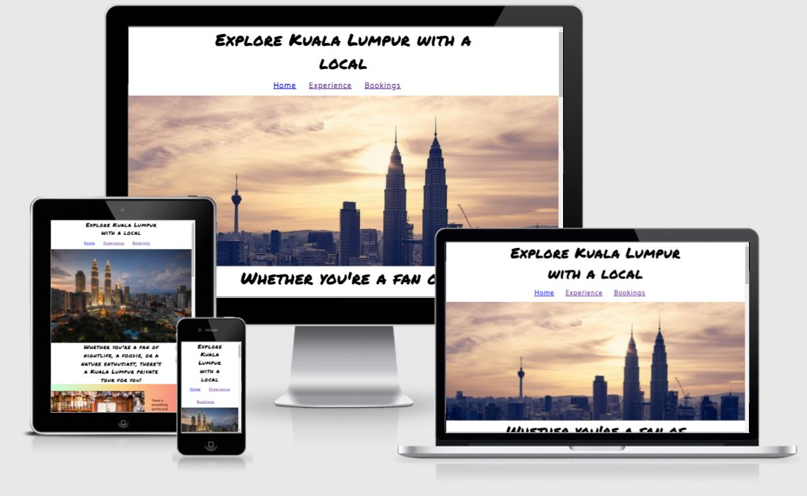
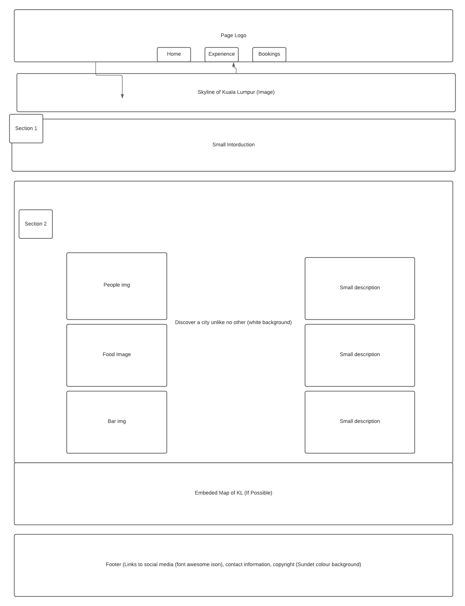
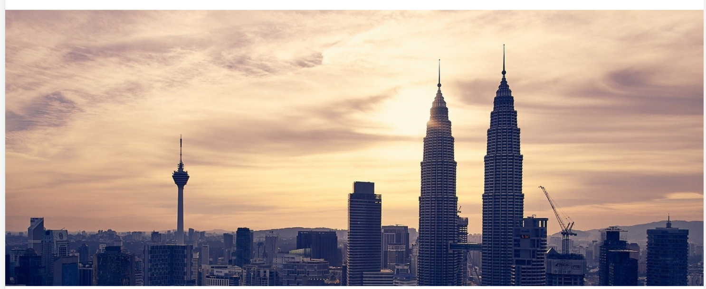
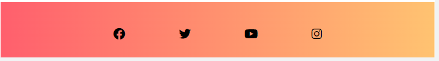
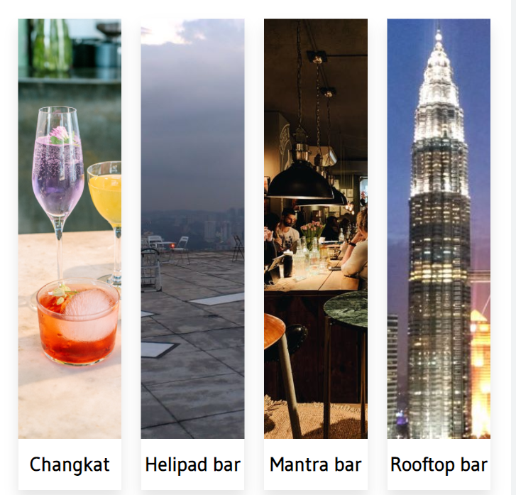
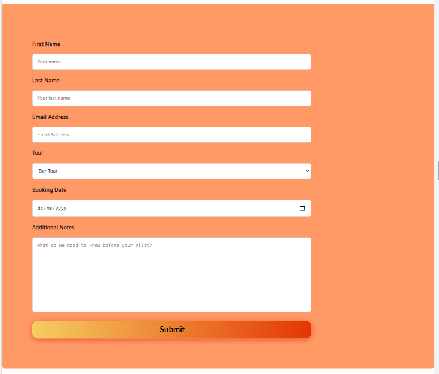
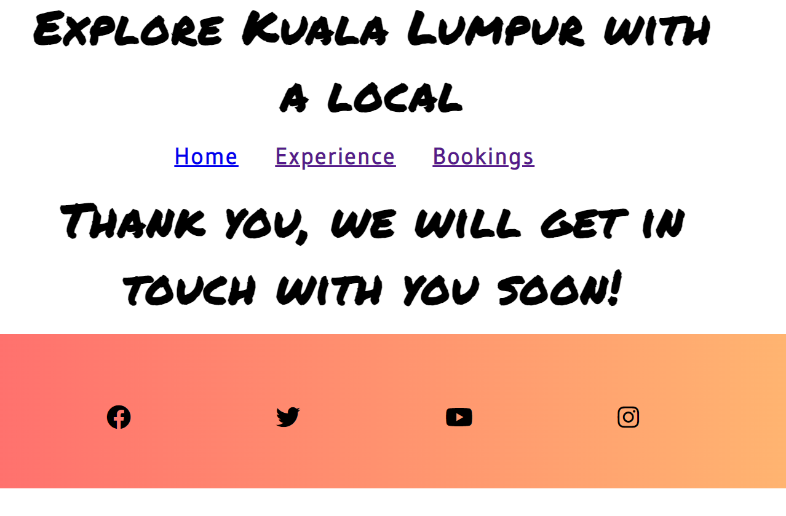

# Explore Kuala Lumpur with a local!
View the live project here: 
[Explore Kuala Lumpur with a local](https://vannesha2021.github.io/Explore-Kuala-Lumpur-with-a-local/)

# Introduction
Aims to connect visitors with authentic genuine experiences when visiting Malaysia's bustling capital, Kuala Lumpur. Visitors can browse a selection of available tours and pick one suitable for them to experience.

# Built with
* HTML
* CSS

# Timeline

* This project began with generating the idea of the title of the website. Once the idea was conceived, I then proceded to create the wireframes to assist in the efficient development of the website. The links to the wireframes are provided below:

# User Experience (UX)

* First time User visitor goals

Upon entering the site, users will be enchanted with the skyline of Kuala lumpur city.
The fonts are easy to read. The navigation bar helps them navigate directly to booking if they wish to book. The images are visually appealing and the animations on the homepage and the experience page brighten the mood of the page.

* Returning Visitor goals

For returning visitors, the page is simple and easy to navigate around. They should be able to find their way around the page once they have used it before.

# Design

* Colour Scheme

The colour scheme was selected to offer potential users ease of reading and navigation, and to avoid a confusing cluttered look.

* Typography

The permanent marker font was chosen for the header to give the page a fun look meanwhile the content font was Gudea which projected a more professional and trustworthy look to the page.

* Imagery

The images which were chosen for the project were selected to demonstrate a vibrant looking city. The pictures were chosen because of their expresive outlook.

# Features

* Responsive to all device sizes.
* Engaging elements

# Technologies Used

* HTML5
* CSS 3

# Frameworks, Libraries and Programs Used

Hover.css
- Hover CSS was used on NAV bar to create an increase in size motion. However, it was removed for screen sizes 950px and below because it was not user friendly in smaller screens.

Google Fonts
- Google fonts were used to import the Gudea and the Permanent Marker which was used throughout the project.

Git
- GIT was used for version control and utilising the Gitpod terminal to commit to Git and push to Github.

GitHub
- Github is used to store the projects code after being pushed from Git.

Lucidchart
- Lucidchart was used to create my wireframes at the start of the project.

Slack Channel
- Slack was used to communicate with other coders, mentors and tutors to resolve issues which I was facing with the project.

# Testings

The W3C Markup Validator and W3C CSS Validator Services were used to validate every page of the project to ensure there were no syntax errors in the project.

[W3C Markup Validator](https://validator.w3.org/) - [Results](https://validator.w3.org/nu/?doc=https%3A%2F%2Fvannesha2021.github.io%2FExplore-Kuala-Lumpur-with-a-local%2F)

[W3C Markup Validator (CSS)](https://validator.w3.org/) - [Results](https://validator.w3.org/nu/?doc=https%3A%2F%2Fvannesha2021.github.io%2FExplore-Kuala-Lumpur-with-a-local%2Fassets%2Fcss%2Fstyle.css)

# Issues Faced during the project

- Allignment of Images

I faced issues with the alignment of the images in the homepage section. Besides that, my indent was not accurate. However after support from Slack, I managed to rectify the issues.

- Experience Section

I learnt how to display images in a certain style, thanks to CodePen!
The margins and movements of the pictures was tough to navigate but once it was designed in CSS, the tour sections came along perfectly.

- Booking page

I faced issues getting the box size width for the "Booking Date"similar to the others. After asking for assistance in Slack, it was amended to the correct size.

Overall

The biggest challenge I faced was getting my page to be responsive. It all came together in the end of the project.

# Credits

Code
UI Gradients
- This site was used to create the gradient background which I used in the project.

W3C
- This site was utilised to validate my code and to know if I had made any errors in my HTML and CSS file.

CodePen
- I used this website to learn how to code for the display of images in my Experience page.

Content
- All content was written by the developer

Media
- Most images were taken from Pexels, Pixabay and my personal gallery.

WebKit
- This site was used to gain gradient color for the site.

Acknowledgements
- DaveHorrocks_5P from Slack assisted me with codes for this project.
- Stephen_5p_lead from Slack assisted me with codes for this project.
- Declan_5P from Slack assisted me with codes for this project.

# Deployment
The project has been developed using Gitpod and GitHub. The project was regularly commited to GitHub during the initial development phase.
The site was deployed to GitHub pages.

The steps to deploy are as follows: In the GitHub repository, navigate to the Settings tab. On the left menu list, select Pages. In the source section drop-down menu, select the Main Branch and click Save. Upon successful save, the Github Pages section will display a message to indicate that the site is ready to be published at https://vannesha2021.github.io/Explore-Kuala-Lumpur-with-a-local/.

# Project walkthrough

Homepage

My hompage begins with the logo. *
I decided to choose a white background because I wanted my header image to stand out. At the same time I believe that my selection of the font makes the start of the page attractive.

 

Navigation Bar

My navigation bar is displayed in the middle of the screen. The reason for this positioning is to make it more visible to users and I decided to change the font to make it look more visually pleasing and not tired.
 

Header Image

I decided to choose this header image because it shows the skyline of Kuala Lumpur and the images also changes when someone is viewing the page from a mobile. The reason I chnaged the header image for mobile is in order to ensure users have a good view of the skyline even on mobile. The mobile version of the header image focuses more on the twin-towers.

Middle section of homepage

The middle section of my page highlights the 3 tours which the site is offering. The bar tour, nature tour and the food tour. There are also 3 images included in this section.

The Map section

I embedded a map of Kuala Lumpur to make it easier for the viewers to view the city. The map was taken from Google Maps. I  also added an animation for the map to tilt slighly when it is hovered upon. This creates a fun look to the map instead of a typical standard map.

The Footer

The footer for this page has a gradient background and it has icons linking to multiple social media platforms. Users will have an easier way to navigate through social media to see pictures of tours or reviews instead of leaving the page entirely.

Experience Page

The "Experience" is the second page for this project. This page gives an in-depth explanation with pictures to show the users what they could be experiencing when they join a tour. The page carries the header and footer from the homepage.

The middle section of this page has a number of different images which visually explains the tour. The pictures also captions the name of the place individually. This similar design applies for the Food tour and the Nature Tour.

Tour Description

The tour description is available for all 3 tours. The description enhances the knowledge of the users on the tours. The page then ends with the footer.

Bookings Page

The bookings page consist of the booking form. Users can fill in their full name, email address. They can also choose their tour from the dropdown list. Besides that, they can choose their booking date from the calander, this makes it easier for the user to pick the date instead of having the user open a seperate tab to view a calendar.

In addition to that, I have also added a column where users can state their question or remarks.

All columns are required to be filled so this prevents empty forms.
Besides that, all columns are filled with placeholders to make it easier for users to know what is required to be filled in.

A Submit has also been added to the form and the submit button links to a thank you page for users to know that the form has been succesfully submitted.

# This project has been proven to be responsive

# Contact details
* Vannesha Andrew - vannesha90@gmail.com